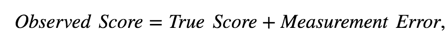
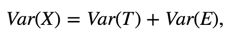
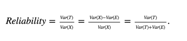
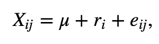
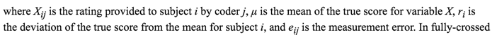
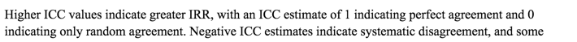
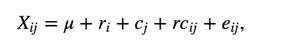
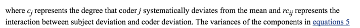

[_the original paper_](http://www.aliquote.org/cours/2012_biomed/biblio/Shrout1979.pdf)

[_Computing Inter-Rater Reliability for Observational Data: An Overview and Tutorial_](http://www.ncbi.nlm.nih.gov/pmc/articles/PMC3402032/)   

  
  

> IRR analysis aims to determine how much of the variance in the observed scores is due to variance in the true scores after the variance due to measurement error between coders has been removed  

> Because true scores (T) and measurement errors (E) cannot be directly accessed, the IRR of an instrument cannot be directly computed. Instead, true scores can be estimated by quantifying the __covariance__ among sets of observed scores (X) provided by different coders for the same set of subjects, where it is assumed that the shared variance between ratings _approximates_ the value of Var (T) and the unshared variance between ratings approximates Var (E), which allows reliability to be estimated in accordance with the above equation

__considerations__

FIRST => {_in this case, the study is all subject is rated by the raters_}  
> It must be decided whether a coding study is designed such that all subjects in a study are rated by multiple coders, or if a subset of subjects are rated by multiple coders with the remainder coded by single coders.   

SECOND => {_in this case, the study is fully crossed design_}   
> Second, it must be decided whether the subjects that are rated by multiple coders will be rated by the same set of coders (fully crossed design) or whether different subjects are rated by different subsets of coders.  

THIRD => {_should be fine_}
> Third, the psychometric properties of the coding system used in a study should be examined for possible areas that could strain IRR estimates.

__Interpretation__
>  Low IRR indicates that the observed ratings contain a large amount of measurement error, which adds noise to the signal a researcher wishes to detect in their hypothesis tests. Low IRR may increase the probability of type-II errors, as the increase in noise may suppress the researcher’s ability to detect a relationship that actually exists, and thus lead to false conclusions about the hypotheses under study.  

__Different variantion of ICC__
+ Kappa for Nominal Variables _could not be used in this case even if selected an arbitrary cutoff as the variable is considered ordinal_  
+ ICC for ordinal, interval and ratio variable

  
  
  

_for fully crossed designs, revised equation account for systematic difference between raters_

_considerations_

__1__ one way or __two way model__ (in fully-crossed design)  
__2__ Good IRR should be either __absolutely agree__ or consistent  
__3__ Unit of analysis: ICC is meant to quantify rating reliability based on __average of multiple raters__ or by a single rater.  
_have to think more about this as the manual score is regarded as the benchmark_    
__4__ coders are random or fixed effect. although ICC calculation for both model is identical, it is important to interpretate generalizability.   
