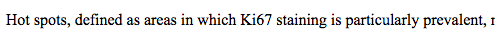
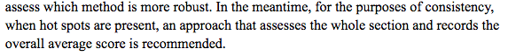
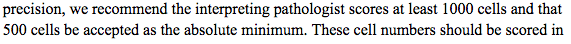
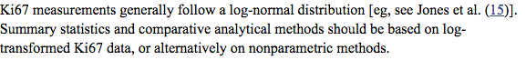
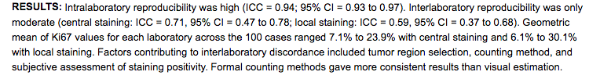
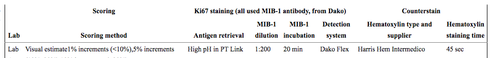
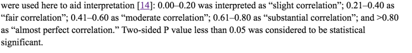
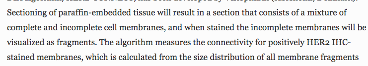

|  |Tian | Willa
| :------------- | :------------- | :---|
|  manual    | NA | 1-6|
|aperio | 2-6 | 1-5 |
|definiens| NA | 1-5 |

[The Ki-67 protein: from the known and the unknown.](http://www-ncbi-nlm-nih-gov/pubmed/6206131)  
> a good summary on ki-67 hisotry predates 2000; its biology, chemistry, and clinical adaptation

[Cell cycle analysis of a cell proliferation-associated human nuclear antigen defined by the monoclonal antibody Ki-67.](http://www.ncbi.nlm.nih.gov/pubmed/6206131)   
> study shown role of ki67 in cell cycle

[_Proliferation markers and survival in early breast cancer: a systematic review and meta-analysis of 85 studies in 32,825 patients._](http://www.ncbi.nlm.nih.gov/pubmed/18455396)  
> good meta analysis to prove ki67 as a predictor
gave a list of cutoff used

[_Ki-67 as prognostic marker in early breast cancer: a meta-analysis of published studies involving 12,155 patients_](http://www.ncbi.nlm.nih.gov/pubmed/17453008)  
> another meta analysis on ki67/mib-1 on disease free survival and overall surival

[_Prognostic value of a combined estrogen receptor, progesterone receptor, Ki-67, and human epidermal growth factor receptor 2 immunohistochemical score and comparison with the Genomic Health recurrence score in early breast cancer._](http://www.ncbi.nlm.nih.gov/pubmed/21990413)   
> IHC markers can give similar amount of prognostic value to mRNA based GHI-RS. ki-67 independently assert and collectively enhance the test.

the phase 0
[_Assessment of Ki67 in breast cancer: recommendations from the International Ki67 in Breast Cancer working group._](http://www.ncbi.nlm.nih.gov/pubmed/21960707)  
> set guide lines for ki67 assessment methods, and found

  

  

  

the phase 1  
[_An international Ki67 reproducibility study._](http://www.ncbi.nlm.nih.gov/pubmed/24203987?dopt=Abstract&holding=npg)  

have to think about parameter for the staining

the phase 2
[_An international study to increase concordance in Ki67 scoring_](http://www.nature.com/modpathol/journal/v28/n6/full/modpathol201538a.html)

the phase 3
[_Analytical validation of a standardized scoring protocol for Ki67: phase 3 of an international multicenter collaboration_](http://www.nature.com/articles/npjbcancer201614)
> expand standardized method on core-cut biopsies for choosing areas to score

[_Standardization for Ki-67 Assessment in Moderately Differentiated Breast Cancer. A Retrospective Analysis of the SAKK 28/12 Study_](http://www.ncbi.nlm.nih.gov/pmc/articles/PMC4401515/)  
> differnet methods of ki-67 assessment. one of them is used in this study: namely considering only condensed proliferative areas (hotspot) also use ICC! 14% is used as cutoff

[_A Comparison of Visual Assessment and Automated Digital Image Analysis of Ki67 Labeling Index in Breast Cancer_](http://www.ncbi.nlm.nih.gov/pmc/articles/PMC4771161/)
> very similar to this study, should borrow its statistics
> ICC used to compare manual assessment and DIA
> wilcoxon signed-rank test compare 2 methods.

[_Comparison of the effect of different techniques for measurement of Ki67 proliferation on reproducibility and prognosis prediction accuracy in breast cancer_](http://www.ncbi.nlm.nih.gov/pubmed/22963617)  
> compared different scoring methods and conclude that DIA approach is the most predictive and reproducible  

[_American Society of Clinical Oncology 2007 update of recommendations for the use of tumor markers in breast cancer._](http://www.ncbi.nlm.nih.gov/pubmed/17954709/)
> ASCO does not recommend the use of ki67 due to its lack of agreement

[_Calculation of the Ki67 index in pancreatic neuroendocrine tumors: a comparative analysis of four counting methodologies_](http://www.nature.com/modpathol/journal/v28/n5/full/modpathol2014156a.html)
> compare 4 counting methodologies
> very short good

[_The region-of-interest size impacts on Ki67 quantification by computer-assisted image analysis in breast cancer._](http://www.ncbi.nlm.nih.gov/pubmed/26206765?dopt=Abstract&holding=npg)  
> ROI affect ki67 scoring in computer-assisted scoring

[_Optimizing HER2 assessment in breast cancer: application of automated image analysis_](http://link.springer.com/article/10.1007%2Fs10549-015-3475-3)

[_Standardization for Ki-67 Assessment in Moderately Differentiated Breast Cancer. A Retrospective Analysis of the SAKK 28/12 Study_](http://www.ncbi.nlm.nih.gov/pmc/articles/PMC4401515/)  
> used BA-plot and Fleiss kappa

[_Assessment of Two Automated Imaging Systems in Evaluating Estrogen Receptor Status in Breast Carcinoma_]()
> similar to our study compare inter and intra-algorithmic variability
